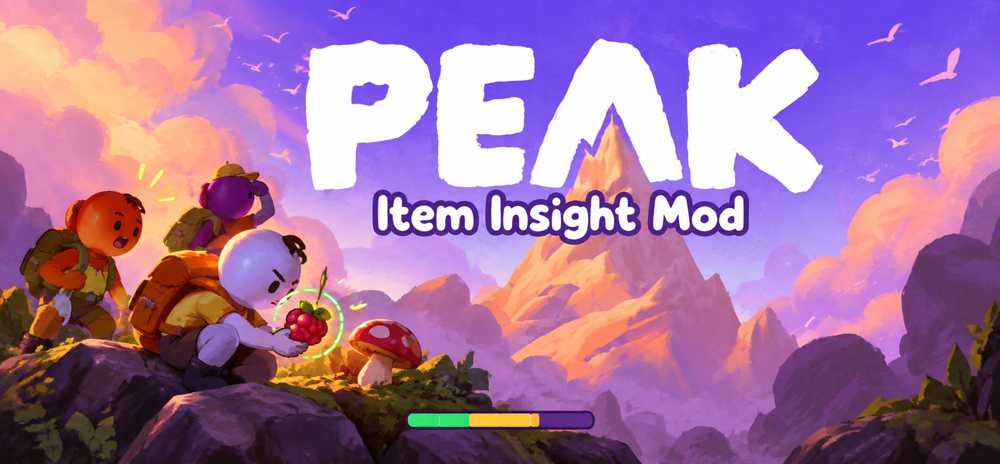
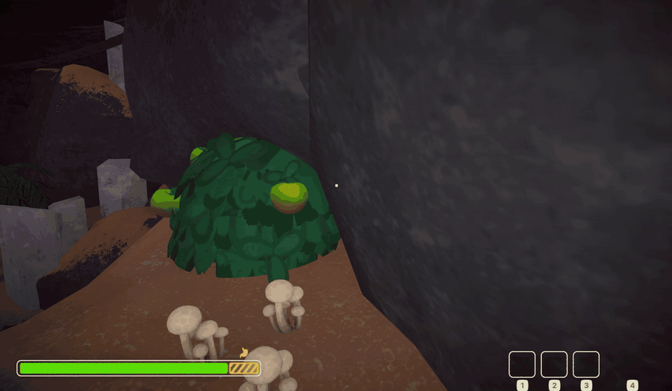
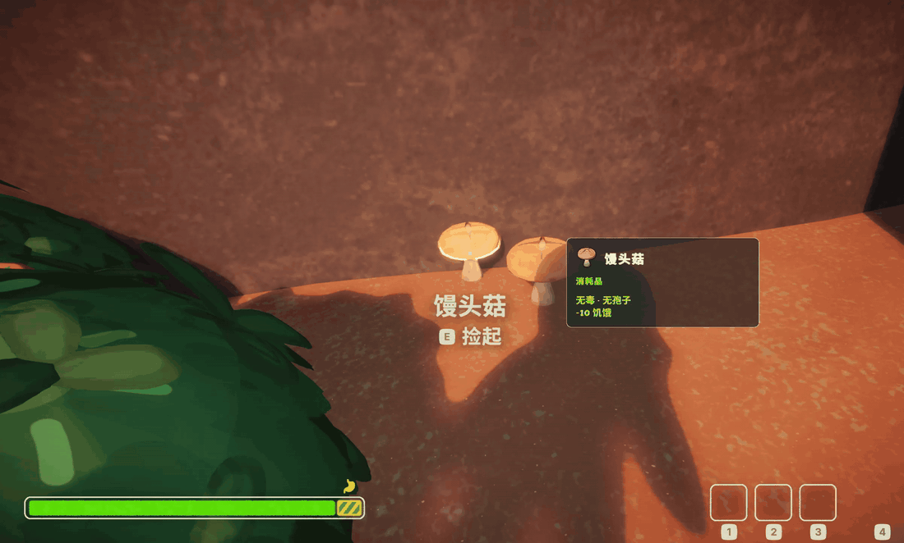
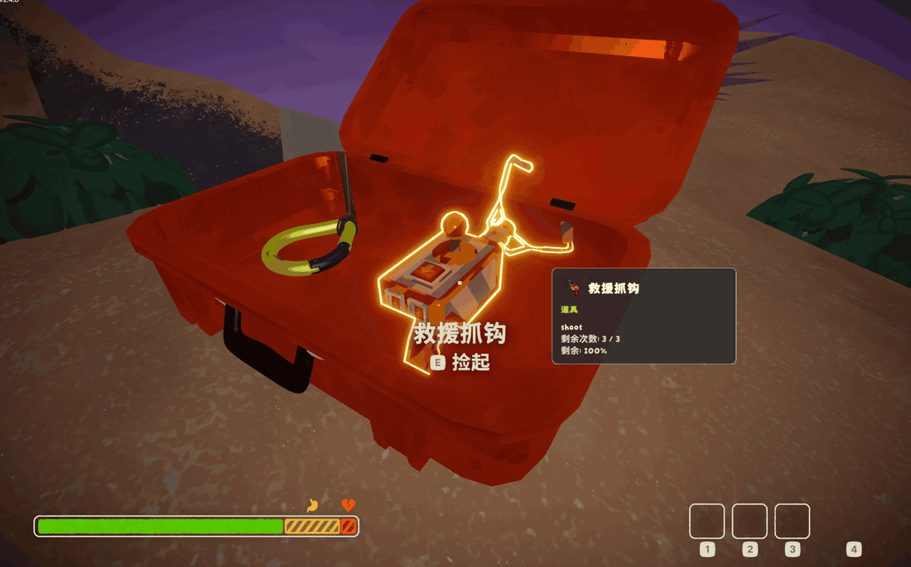

<p align="center">
  
</p>

<h1 align="center">PEAK Item Insight</h1>

<p align="center"><strong>See what changes before you use it.</strong><br />
Preview recovery and poison on your stamina bar. Know what you're holding.</p>

<p align="center"><strong>使用前，看见变化。</strong><br />
精力条预览恢复与毒性，物品卡说明手中用途。</p>

<p align="center">
  <a href="https://thunderstore.io/c/peak/p/Rachel560lu/PeakItemInsight/"></a>
  <a href="https://thunderstore.io/c/peak/p/Rachel560lu/PeakItemInsight/"></a>
  <a href="https://thunderstore.io/c/peak/p/Rachel560lu/PeakItemInsight/versions"></a>
  
</p>

<p align="center">
  <a href="https://thunderstore.io/c/peak/p/Rachel560lu/PeakItemInsight/">Download</a> ·
  <a href="#中文">简体中文</a> ·
  <a href="#english">English</a> ·
  <a href="https://github.com/Rachel560lu/peak-item-insight/issues">Report an issue</a>
</p>

## 实机演示 / Gameplay demos

玩家提供的实际游戏录屏；保留原速，裁掉结尾暂停菜单。GIF 不含声音。以下示例展示预览交互，不代表所有物品、角色或多人环境均已验证。

Player-recorded gameplay at original speed, with trailing pause menus trimmed and audio omitted. These examples demonstrate preview behavior, not exhaustive item or multiplayer certification.

### 有毒食物 / Poisonous food

准星对准绿脆莓，简介显示有毒及延迟、持续时间，精力条上的紫色区域预览新增毒素占用。

Hover over a Green Crispberry to see its poison warning, timing and pulsing poison preview on the stamina HUD.



### 无毒食物 / Non-poisonous food

准星对准示例中的无毒蘑菇，饥饿区域以健康绿色闪烁，展示预计恢复的部分。

Hover over the non-poisonous mushroom shown here to preview hunger recovery as a green pulse over the affected segment.



### 物品简介 / Item information

救援抓钩的图标、类别、操作提示和剩余次数。此素材原本为静态截图，GIF 同样是静态图；[查看原始清晰截图 / View original screenshot](docs/assets/demos/item-description.png)。

Rescue Claw icon, category, action prompt and remaining uses. This GIF is a still image converted from the supplied screenshot.



## 中文

为 PEAK 制作的非官方 BepInEx 物品提示 Mod。准星对准或手持物品时，预览已识别的效果，并查看简短的使用说明。

**当前发布包：0.2.3 · 插件运行版本：0.2.2 · 已在 [Thunderstore](https://thunderstore.io/c/peak/p/Rachel560lu/PeakItemInsight/) 发布 · 实验版。** 玩家于 2026-09-11 反馈本次实机测试可用，并提供了上方三类演示。六种已核对毒食物的数值及合成 HUD 检查通过，81 项离线检查通过；不将这些示例扩大为“所有影响精力条的物品”全覆盖声明。详见[0.2.2 验证记录](docs/poison-preview-022.md)与[食物毒性核对](docs/food-toxicity-audit.md)。

源码现已在 GitHub 以 MIT 许可公开。Thunderstore 0.2.3 加入上方三类 GIF 演示与源码链接，沿用已测试的 0.2.2 DLL，没有游戏功能改动。旧 0.1.9 ZIP 不可使用；标准 Modded 全新 profile 启动仍未独立验证。见[最新发布记录](docs/release-023.md)。

### 功能与预览方式

- **准星优先，手持补充：**有悬停目标时预览该物品；没有目标时预览当前手持物品。卡片不再重复显示来源。
- **原生 HUD 恢复预览：**饥饿或伤势区域中，预计能恢复的部分在原色与健康绿色之间柔和闪烁，周期约 1.4 秒。
- **完整／部分／零恢复：**饥饿 30、食物减少 10，则黄色区域的三分之一闪烁；饥饿 5、食物可减少 10，则整段闪烁；没有饥饿时，不显示饥饿恢复闪烁。伤势使用相同逻辑。
- **效果与用途：**优先显示毒性／孢子风险、单次效果及有意义的剩余次数。移除“烹饪：否”和通用说明段落。确定的状态增加闪烁显示，减少时原位绿闪；持续毒性按累计量预估，额外精力和无限精力也有独立提示。持续预估不包含自然恢复、环境、已有增益的叠加。
- **切换与清除：**空手看地板会隐藏预览；手持物品看地板则保留手持预览。正在使用的物品暂停预览，使用后重新计算。

预览只是提示，不会真正使用物品、修改角色状态或发送游戏网络事件。新增状态预览期间会临时隐藏原生状态图像、绘制独立副本，退出预览时恢复原透明度；这不是与其他 HUD Mod 的兼容性保证。

### 安装与安全测试

开发环境为 Windows、PEAK 2.4.b、BepInEx 5.4.23.3；其他游戏版本、平台、多人角色及其他 Mod 的兼容性尚未验证。

1. 正常退出 PEAK，备份存档，在 Mod 管理器中新建独立测试 profile，保留日常配置。
2. 安装依赖 `BepInEx-BepInExPack_PEAK-5.4.2403`。
3. 将构建出的 `PeakItemInsight.dll` 放入该 profile 的 `BepInEx/plugins/PeakItemInsight/`，只保留一份 DLL。
4. 从管理器启动 Modded PEAK，并确认**本次运行**的日志包含 `PEAK Item Insight 0.2.2 loaded`。这是预期流程，不代表本实验版已通过全新环境启动验收。

详细故障排查与卸载方法见[玩家说明](thunderstore/README.md)。本仓库不包含游戏 DLL、BepInEx 安装包、存档或编译产物；克隆源码并不等于安装 Mod。

### 配置

成功加载后，配置位于测试 profile 的 `BepInEx/config/dev.rachel.peakiteminsight.cfg`。建议关闭游戏后编辑。

| 配置项 | 默认值 | 用途 |
| --- | --- | --- |
| `General / Enabled` | `true` | 总开关 |
| `General / HoverDelaySeconds` | `0.12` | 预览延迟，范围 0–1 秒 |
| `UI / PanelScale` | `1` | 面板缩放，范围 0.5–2 |
| `UI / OffsetX`, `OffsetY` | `32`, `-90` | 相对屏幕中心的面板位置 |
| `UI / Language` | `Auto` | `Auto` 跟随游戏，或 `Chinese` / `English` |
| `UI / ShowDetails` | `false` | 显示状态 Before → After 数值 |
| `UI / BackgroundOpacity` | `0.88` | 背景透明度 |
| `UI / AnimateRecovery`, `RecoveryStrength` | `true`, `1` | 闪烁开关与强度 |
| `Debug / ShowDebugIds` | `false` | 显示物品 ID，便于排查 |

### 准确性与已知限制

范围为可拾取物品，不包括瞄准环境荆棘或孢子云；食用物品带来的毒素／孢子仍属于预览范围。世界物品若仅有预制体资料，未确认的风险显示“未知”；有明确致毒／孢子效果仍标示危险。普通毒蘑菇读取实际毒性组件，特殊蘑菇效果另读本局 `MushroomManager` 映射（仅核对 PEAK 2.4.b）；不按名称或颜色猜测。当前加载的 194 个物品资源未提供可用的本地化简介条目，因此采用已知用途与效果说明回退，不宣称已有完整图鉴。

这不是完整的物品安全图鉴。支持已识别的即时和持续主操作效果；随机范围伤害、目标相关道具、特殊角色、环境作用和部分条件效果仍不完整。持续预估不是保证的最终状态。**未显示中毒效果，不等于食物无毒。** 未确定的风险仍如实显示“未知”。

新版卡片含图标、类别、独立毒素／孢子风险及正负效果行，默认不再显示小进度条。语言默认跟随游戏，可选中文或英文；尚未覆盖的操作文案可能保留游戏原文。“客户端只读”的设计不等于多人兼容性已经通过验证。

日志保存在本地，不会由此插件自动上传。报告问题时附上游戏／Mod 版本、物品、悬停或手持、使用前状态和复现步骤；分享日志前请遮盖用户名、个人路径及房间信息。

### 构建、验证与发布

需要 .NET SDK、合法安装的 PEAK 及对应 BepInEx 依赖。游戏程序集路径可通过以下参数覆盖：

```powershell
dotnet build -c Release -p:PeakManagedDir="X:\path\to\PEAK_Data\Managed"
```

产物位于 `bin/Release/netstandard2.1/PeakItemInsight.dll`。当前项目的 Harmony 引用及部分工具／测试脚本仍含开发机路径；换电脑时需要调整自己的 BepInEx 路径，不能仅改 `PeakManagedDir` 就假定全部可用。

- `scripts/verify.ps1`：构建、核心逻辑及 API／只读行为检查，0.2.2 记录 **81 项通过、0 项失败**。它依赖开发环境的 `.dotnet-sdk` 和游戏／BepInEx 路径，不是独立 CI。
- `scripts/start-isolated-test.ps1 -SmokeTest -ExitAfterSmoke`：**开发机专用**标题页合成 UI 测试，不是通用安装方式。要求游戏关闭、既有测试 profile junction 正确；临时添加 `steam_appid.txt`，正常退出后清理。不要运行中中断；若被强制中断，应先关游戏，再核对并仅移除它生成且未变化的临时文件。
- 验证需同一游戏进程中的版本／MVID、首帧、持续心跳及 `SMOKE_HUNGER_PASS`、`SMOKE_RECOVERY_ROUTING_PASS`、`SMOKE_UI_PASS`。仅有启动日志或合成截图不代表真实物品链路已验收。
- `scripts/package.ps1`：使用本地 `dist/PeakItemInsight.dll` 和记录的哈希组装、校验候选 ZIP；不构建、不安装、不启动游戏，也不上传。`dist/` 不入库，新克隆需要先准备并验证对应 DLL，不能绕过证据哈希检查。

[验证计划](docs/verification-plan.md) · [验证结果](docs/verification-results.md) · [饥饿预览](docs/hunger-pulse-018.md) · [伤势与手持验收](docs/recovery-held-019.md) · [发布清单](docs/release-checklist.md) · [更新日志](CHANGELOG.md)

采用 [MIT 许可证](LICENSE)，Copyright (c) 2026 Rachel560lu。游戏素材和依赖保留各自权利；本项目与 PEAK 开发商无隶属或官方背书关系。

---

## English

An unofficial BepInEx item-insight mod for PEAK. Hover over or hold an item to preview recognized effects and read concise usage information.

**Current package: 0.2.3 · Plugin runtime: 0.2.2 · Experimental · Published on [Thunderstore](https://thunderstore.io/c/peak/p/Rachel560lu/PeakItemInsight/).** On September 11, 2026, the player reported successful in-game testing and supplied the three demonstrations above. All six audited toxic-food resource checks and 81 offline checks passed. This is not a claim of complete coverage of every stamina-affecting item. See the [0.2.2 verification record](docs/poison-preview-022.md) and [food toxicity audit](docs/food-toxicity-audit.md).

The source is now public on GitHub under MIT. Thunderstore 0.2.3 adds the three GIF demonstrations and source links, retaining the tested 0.2.2 DLL with no gameplay changes. Do not use old 0.1.9 ZIPs. Standard fresh-profile Modded startup remains independently unverified. See the [current release record](docs/release-023.md).

### Features and preview behavior

- **Hover first, held fallback:** preview the hovered item when one exists; otherwise preview the currently held item. Redundant source labels are removed.
- **Native HUD recovery preview:** the recoverable part of the hunger or injury segment gently pulses between its original color and healthy green, on an approximately 1.4-second cycle.
- **Full, partial and zero recovery:** with hunger at 30 and food that removes 10, one third of the yellow segment pulses. With hunger at 5 and food that removes 10, the whole segment pulses. At zero hunger, there is no hunger recovery pulse. Injury recovery follows the same logic.
- **Effects and usage:** prioritize poison/spore risk, per-use effects and meaningful remaining uses. Remove uncooked/no labels and generic explanations. Known status gains pulse in their native colors; recovery pulses green. Timed poison uses estimated cumulative amounts; extra/infinite stamina has visual cues. Estimates exclude natural recovery, environment and interactions with existing buffs.
- **Switching and clearing:** empty hands plus no target hides the preview. Looking at the floor while holding an item intentionally keeps a held preview. The item being used pauses its preview and is recalculated afterward.

Previews are informational: the plugin does not invoke item-use actions, mutate player status or send gameplay network events. During status increases it temporarily suppresses native badge images, draws owned copies, then restores visibility; compatibility with other HUD mods is not established.

### Installation and safe testing

Development testing used Windows, PEAK 2.4.b and BepInEx 5.4.23.3. Compatibility with other game versions, platforms, multiplayer roles and other mods has not been established.

1. Close PEAK normally, back up your saves and create a separate test profile in your mod manager. Preserve your everyday profile.
2. Install `BepInEx-BepInExPack_PEAK-5.4.2403`.
3. Place the built `PeakItemInsight.dll` in that profile's `BepInEx/plugins/PeakItemInsight/` directory. Keep only one copy.
4. Launch Modded PEAK through the manager and confirm the **current session's** log includes `PEAK Item Insight 0.2.2 loaded`. This is the intended workflow, not a claim of clean-install certification.

See the [player guide](thunderstore/README.md) for troubleshooting and removal. Game assemblies, BepInEx installers, saves and compiled binaries are not included in this repository; cloning the source does not install the mod.

### Configuration

After a successful load, configuration is generated at `BepInEx/config/dev.rachel.peakiteminsight.cfg` in the test profile. Edit it while the game is closed.

| Setting | Default | Purpose |
| --- | --- | --- |
| `General / Enabled` | `true` | Master switch |
| `General / HoverDelaySeconds` | `0.12` | Preview delay, 0–1 seconds |
| `UI / PanelScale` | `1` | Panel scale, 0.5–2 |
| `UI / OffsetX`, `OffsetY` | `32`, `-90` | Panel position relative to screen center |
| `UI / Language` | `Auto` | Follow the game, or `Chinese` / `English` |
| `UI / ShowDetails` | `false` | Include projected Before → After values |
| `UI / BackgroundOpacity` | `0.88` | Background opacity |
| `UI / AnimateRecovery`, `RecoveryStrength` | `true`, `1` | Animation and recovery opacity |
| `Debug / ShowDebugIds` | `false` | Include item IDs for troubleshooting |

### Accuracy and known limitations

Scope is pick-up-able items, not targeting environmental thorns or spore clouds; poison/spores caused by using an item remain in scope. Prefab-only world data cannot establish safety: unconfirmed risks stay unknown, while explicit harmful facts remain flagged. Ordinary poisonous mushrooms use their actual poison components; special mushroom effects separately read the current level mapping (audited only for PEAK 2.4.b), never names or colors. The 194 loaded item assets exposed no usable localized description entries; known usage/effect text is used as a fallback, not a complete encyclopedia.

This is not a complete item-safety guide. Recognized immediate and timed primary-use effects are supported; random area damage, target-dependent tools, special characters, environmental and some conditional effects remain incomplete. Timed totals are estimates, not guaranteed final states. **An absent poison prediction does not prove food is safe.** Unconfirmed risks remain explicitly unknown.

The redesigned card includes an icon, category, separate poison/spore risks and signed effects, without default mini-bars. Language follows the game by default, with Chinese/English overrides; unsupported prompts may retain the game text. A client-side, read-only design is not proof of multiplayer compatibility.

Logs stay local and are not automatically uploaded by this plugin. Reports should include game/mod versions, the item, hover versus held, pre-use state and reproduction steps. Redact usernames, personal paths and room details before sharing logs.

### Building, verification and releases

Requires a .NET SDK, a legitimate PEAK installation and matching BepInEx dependencies. Override the game assembly directory as needed:

```powershell
dotnet build -c Release -p:PeakManagedDir="X:\path\to\PEAK_Data\Managed"
```

Output: `bin/Release/netstandard2.1/PeakItemInsight.dll`. The project's Harmony reference and some tools/test scripts still contain development-machine paths. On another machine, adjust those BepInEx paths too; overriding `PeakManagedDir` alone does not make every build and test portable.

- `scripts/verify.ps1`: builds and checks core logic, game APIs and read-only behavior. The 0.2.2 recorded result is **81 passed, 0 failed**. It depends on the development environment's `.dotnet-sdk` and game/BepInEx paths; it is not standalone CI.
- `scripts/start-isolated-test.ps1 -SmokeTest -ExitAfterSmoke`: **development-machine-specific** synthetic UI tests at the title screen, not a general installer. It requires a closed game and the existing test-profile junction. It adds a temporary `steam_appid.txt`, exits normally and cleans up. Do not interrupt it while running. If forcibly interrupted, close the game, then verify and remove only the unchanged temporary file it created.
- Verification requires one game process's version/MVID, first frame, repeated heartbeats and `SMOKE_HUNGER_PASS`, `SMOKE_RECOVERY_ROUTING_PASS`, `SMOKE_UI_PASS`. Startup logs or synthetic screenshots alone do not establish real-item acceptance.
- `scripts/package.ps1`: assembles and validates a candidate ZIP from local `dist/PeakItemInsight.dll` against the recorded hash. It does not build, install, launch or upload. Since `dist/` is excluded from Git, a fresh clone must first prepare and verify the corresponding DLL; do not bypass the evidence hash check.

[Verification plan](docs/verification-plan.md) · [Results](docs/verification-results.md) · [Hunger preview](docs/hunger-pulse-018.md) · [Injury/held acceptance](docs/recovery-held-019.md) · [Release checklist](docs/release-checklist.md) · [Changelog](CHANGELOG.md)

Licensed under the [MIT License](LICENSE), Copyright (c) 2026 Rachel560lu. Game assets and dependencies retain their respective rights. Not affiliated with or endorsed by the PEAK developers.
