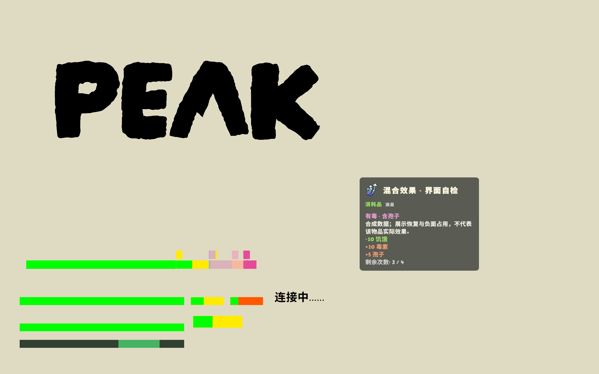
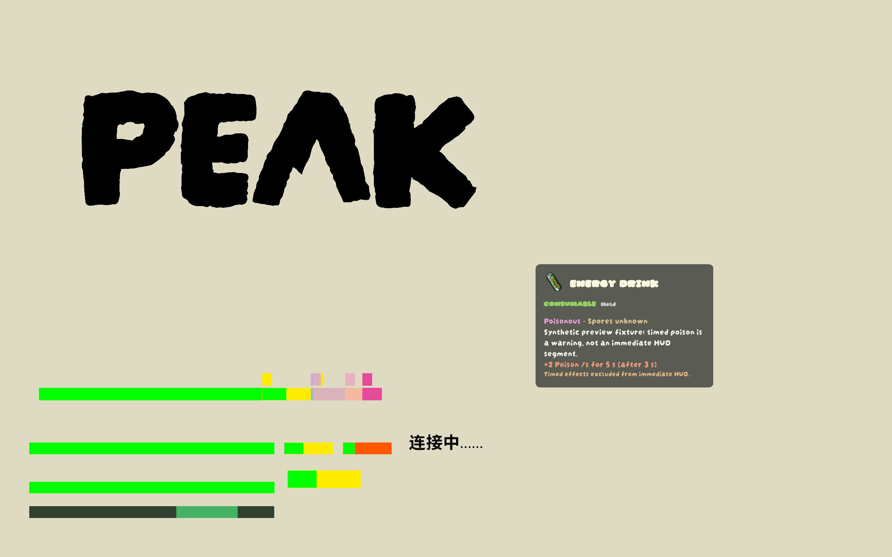

# 0.2.0 预览优化：实施与测试记录

日期：2026-09-09（Asia/Singapore）  
状态：核心实现完成、离线与隔离合成测试通过；真实局内验收未完成，不能公开发布。

## 已实现

- 卡片与 HUD 共享同一 `ItemPreview`，保留原始效果、即时 Before/After、毒素／孢子独立风险及时间说明。
- 保留原生饥饿／伤势可恢复区域绿闪，增加毒素／孢子恢复，以及确定即时新增状态的浅色幽灵段和图标。
- 同时恢复与增加负面状态按状态分别表现，不以净精力差隐藏风险。新增段按原生 badge 顺序从右侧布局，当前最小宽度保留；新增状态使用最小可视宽度，超过条框的范围裁掉，数值仍在卡片显示。
- 新增段使用只含图像的副本。预览期间暂时覆盖原生 badge 的 CanvasGroup 透明度，Hide/Dispose 恢复原值；不修改其宽度、颜色、活动状态，不删除既存 CanvasGroup。兼容其他 HUD Mod 仍待验收。
- 识别即时状态动作、即时 AdjustStatus affliction、持续中毒、部分加速描述，以及 PEAK 2.4.b 当前关卡的蘑菇映射。按 OnPressed → OnCastFinished → 最后一次 OnConsumed 读取路径；一次动作订阅多个触发点时分别计入。
- 蘑菇不按颜色猜测：读取 `MushroomManager.mushroomEffects/mushroomStamAmt`。已核对 effect 8 的即时 +25 孢子和 effect 4 的恢复分支；没有本局映射或版本不同则明确未知。爆炸范围的实际状态伤害不量化。
- 毒性风险来自原始有害事实，不来自被上限截断后的净值。未知动作、世界预制体缺少实例状态时，不宣布无毒／无孢子。
- 中英卡片采用游戏字体、图标、类别、风险、说明、带正负号的效果行、圆角半透明背景及细边框；默认取消小进度条，保留可选 Before/After 详情。
- Auto 跟随游戏语言，显式 Chinese/English 不修改游戏语言。新增背景透明度、恢复动画开关及强度配置。屏幕内定位、统一 Canvas 缩放；过长内容缩小正文至 14，但极长卡片仍需专项验收。
- 保留准星优先／手持回退与忙碌时抑制；每 0.25 秒重新检查条件／语言配置，避免仅依赖旧状态哈希。
- 构建脚本现在遇到编译失败会抛错，不能带着旧 DLL 继续后续步骤。

## 参考与实现差异

已在本机核对 [OnlyCook/peak-effect-preview](https://github.com/OnlyCook/peak-effect-preview) commit
`fa98a8a05b698e905c7ec292aadea7cd761534d3` 的 MIT 许可及 GhostBadge/GhostSegment/RemovalPulse 等代码。
参考的新增长段为浅色半透明，移除段才脉冲；本实现保持用户此前验收的黄／绿恢复动画，不宣称完整复刻其布局、浪费指示、额外精力、石化或持续效果。
未 fork 或整体复制参考组件；UI 使用游戏运行时 sprite 引用，仓库不附游戏程序集或贴图包。

## 可复核证据

| 项目 | 结果 |
| --- | --- |
| Release 构建 | 0 warnings / 0 errors |
| `scripts/verify.ps1` | 64 passed / 0 failed |
| 随机检查 | 原有投影／脉冲与新增布局各含 10,000 次样本 |
| 只读扫描 | 编译产物无物品使用、Consume、Add/AdjustStatus、AddAffliction、RPC、GetData 等禁止调用 |
| Unity 最终进程 | PID 31684，2026-09-09 23:46:13 +08 启动，退出码 0 |
| 最终版本 / MVID | 0.2.0 / `392e6128-459c-42ee-9cb3-6c7181d8b583` |
| 生命周期 | START、FIRST_FRAME、持续 HEARTBEAT、所有烟雾测试 PASS，最终正常销毁 |
| 新测试 | 不活动毒素模板、已有孢子增加、混合恢复／增加、清除、重绑定、既存透明度恢复、上限下风险、独立风险、映射／未知蘑菇、英文时间表达 |
| 实际资源只读检查 | 已加载 194 个 Item，其中 74 个食物进入效果读取；不等于 74 种食物已实际吃下验证 |
| Mod 诊断 | 最终同 PID trace 无 ERROR |
| 游戏其他日志 | 仍有 EOS 外部令牌认证失败、BepInEx Unity 日志 writer 问题；不宣称整个游戏日志零错误或联网已通过 |

最终构建、隔离 profile 和 `dist/dev-0.2.0/PeakItemInsight.dll` SHA-256 一致：

`99B8F495D447B902C38C9783E9AE318AD1C32310572822F57351BCE4CD6CF7FB`

本机原始证据：`backups/optimization-020-evidence/session-31684-20260909T154622208.log` 及两张 PNG；日志含个人路径，不纳入 Git。

首轮 PID 7404 自检失败：重复 AddComponent CanvasGroup 返回 null。修复为既存组件的可恢复透明度覆盖，增加恢复断言后，后续 PID 63176、38812 与最终 31684 通过。最终结论只绑定上面的最终 DLL，不借用失败版本或旧版本证据。

## 双语截图（合成，不是真实物品效果）

下方均为 2560×1600 标题界面自动测试。色块是 UI 模板夹具，并非已验证的局内原生贴图。图中各排是独立测试夹具，不把英文示例卡的定时效果解释为左侧混合状态条的来源。
英文卡复用了能量饮料图标，但故意使用合成毒性数值测试风险／持续时间排版，**不是能量饮料的实际效果说明**。
已目视检查标题、中文“孢子”等字形、英文字体、换行及卡片边界；尚无跨分辨率／长名称全部通过的证据。

## 存档、部署和发布边界

- 仅替换 `PeakItemInsight-Test` profile 的单一 DLL，游戏正常退出后才替换。未动日常 profile。
- 备份旧 DLL 与存档：`backups/pre-020-20260909-233457`。
- quicksave 测试前后 SHA-256 相同：`306D8A3C08C8D1E6B7939E2229FE7B68E5D8C6FBE542D0CF2E004BDE88D5518D`。
- 测试只停留在标题界面，未进入／继续存档，未消耗物品。临时 `steam_appid.txt` 已清理。
- 旧 `dist/PeakItemInsight.dll`、0.1.9 ZIP、`thunderstore/` 清单与发布证据未升级。当前调用打包脚本会因 0.2.0 源码与 0.1.9 清单不一致而拒绝，这是发布门槛，不应绕过。
- 未 Git push，未上传 Thunderstore/Nexus，未变更仓库可见性。

## 仍待完成

1. 真实关卡中 FakeItem／植物挂点／已拾取实例的对应与当前蘑菇映射；标题界面没有本局映射，所以那些蘑菇显示未知是预期降级。
2. 真实毒素／孢子 sprite、图标布局、最小宽度、状态总和超过可视容量、已有 buff／免疫与特殊状态等实际画面及结果对照。
3. 同一状态的复杂往返变化、全部持续／条件效果、烹饪触发变化、特殊用途／对队友使用、未知工具的完整说明。
4. 1080p、1440p、宽屏、不同缩放／长名称／极长效果卡、长时间悬停分配与帧率、与其他 HUD Mod 共存。
5. 标准管理器全新安装和 Steam 启动、联网认证、实际多人验证及发布材料。

此次检查没有从 194 个资源取得可用的本地化简介条目（descriptions=0），故简介仍回退到已知用途和效果说明；不能宣传为完整物品图鉴。
持续毒性只显示每秒、时长、延迟，不画未经实测确认的即时总毒量；额外精力和石化仍为后续扩展。

## 集中实机验收步骤（下一阶段）

先确认隔离启动日志为本次 0.2.0 / MVID；普通管理器若不能稳定加载，先解决启动，勿继续把它当作 UI 错误。

1. 空手悬停已知减饥饿食物：确认卡片、原黄色区域恢复闪烁；移开应清除。
2. 看确定即时致毒／含孢子的真实物品：确认危险标签和相应新增幽灵段。只有持续毒性的物品应显示时间警告，不要求即时毒素段。
3. 拿起同一物品看地板，确认“手持”；再悬停普通工具，确认切换到该工具且旧食物 HUD 清除。
4. 有伤势／毒素／孢子时悬停对应治疗物品；不要为了测试刻意致死。检查恢复区域和其他状态不乱动，暂停／离局后无隐藏原生状态残留。
5. 若要实际使用核对，记录使用前状态、卡片、使用完成的时间点和结果；持续效果单独测，不能把自然恢复或营火效果归到食物。

本记录不将上述未执行项目标记为 PASS。
