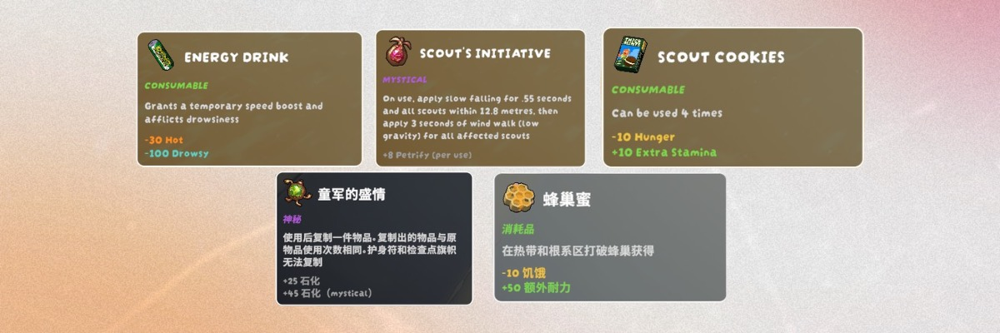

# 预览精力条与物品简介卡优化计划

日期：2026-09-09  
基线：PeakItemInsight 0.1.9  
状态：0.2.0 已实施核心数据、HUD 和卡片；自动化与 Unity 隔离合成测试已执行。完整实机验收、跨分辨率及兼容性仍待完成；详见 [实施与测试记录](preview-optimization-020.md)。不代表允许公开发布。

## 1. 最终目标

准星对准地上的可食用物／道具，或将其拿在手里时：

1. 简介卡快速回答“是什么、是否有毒／含孢子、怎么用、本次有什么效果”。
2. 原生精力条直接表达本次使用带来的状态恢复和新增负面占用。
3. 卡片和 HUD 使用同一个物品实例、玩家状态快照与预测结果，不各算一套。
4. 无法可靠识别时明确显示未知，不伪造精确数值、不将未发现毒性判为无毒。
5. 全程只读取游戏数据、绘制预览，不执行物品操作或修改真实角色状态。

继续独立实现，不 fork。参考别人的表现、信息组织和处理思路，不默认复制代码、文案或素材；如确需复用，先核对相应版本的许可和署名要求。

## 2. 参考及优先级

| 部分 | 参考 | 对齐内容 |
| --- | --- | --- |
| 原生 HUD | [Effect Preview — Nexus](https://www.nexusmods.com/peak/mods/213)、[源码](https://github.com/OnlyCook/peak-effect-preview) | 状态增减、幽灵状态段、移除提示、原生图标和布局，避免独立漂浮方块 |
| 简介卡视觉 | 下方用户提供的参考图 | 字体风格、图标与标题、彩色类型、正文、逐行效果、圆角与细描边 |
| 简介卡组织 | [peak-item-tooltip](https://github.com/knekly/peak-item-tooltip) | 悬停／手持信息、名称、类型、用途、状态效果及中英显示 |
| 复杂效果描述 | [ItemInfoDisplay](https://github.com/cherrycove/ItemInfoDisplay) | 烹饪、剩余次数、条件性和持续效果的可读描述 |

参考图仅用于设计对照，不作为我们已经实现的截图，不将图中具体描述和数值直接写入物品数据库。

**参考核实边界：**此前已读取 Effect Preview 的页面和仓库说明，但 Nexus 示例图片加载失败，尚未核实逐帧视觉效果。实施前必须检查参考渲染代码或实际演示，记录对应 commit／版本以及新增段、移除段、图标与动画规则。不能将推测写成“已经与参考一致”。

优先保留用户已验收的饥饿原位黄／绿恢复闪烁；毒素／孢子新增段跟随 Effect Preview，经核实后确定细节。不要把“新增负面状态一律来回闪烁”当成已决定的规则。如果参考与已有验收存在冲突，先展示差异再调整。

## 3. 当前基线与缺口

| 现状 | 本次需要补齐 |
| --- | --- |
| 饥饿恢复闪烁已有用户实机确认 | 保持完整／部分／零恢复回归 |
| 伤势闪烁和手持选择已实现，自动化／合成检查通过 | 仍需真实局内验收，不能直接记作已通过 |
| 原生恢复图层仅覆盖 Hunger／Injury | 新增 Poison／Spores 的恢复与增加预览，支持原本不存在的状态段 |
| Provider 只识别部分即时效果 | 审计持续中毒、孢子、条件触发、多次食用和世界物品数据来源 |
| 模型主要是合并后的 Before／After | 保留原始效果、条件、时间范围与识别完整性，支持可靠风险判断 |
| 面板缺少图标、类型、明确风险信息，仍有重复小条和长警告 | 按参考重排卡片、完善本地化与内容层级 |
| 普通 Steam／管理器加载曾不稳定 | 保持独立发布阻碍；本次 UI 优化不等于解决启动问题 |

基线证据见 [0.1.9 记录](recovery-held-019.md)；已有 54 项检查不能代替新增功能的测试。

## 4. 统一的数据与识别规则

### 4.1 物品来源

- 保持“准星目标优先，没有目标才回退到当前手持物品”。悬停普通工具／未知物品时，不偷偷显示手里食物的 HUD。
- 源类型和实例 ID 一起构成目标身份；同种物品的不同实例也要重新计算。
- 草地／树上尚未拾取的莓果、蘑菇等必须追踪到实际可交互／可食用实例或其可靠数据源，不能只按植物外观、颜色、名称子串猜测。
- 核对 FakeItem、真实 Item、植物挂点与变体之间的映射；若只能获取缺少实例状态的预制体，标记限制，不输出已确认安全。
- 原有使用中暂停、取消恢复、切换清理、暂停／场景切换重绑定规则保留。

### 4.2 扩展预测模型（拟议结构，名称可在实现时调整）

- `EffectFact`：效果类型、原始变化量、触发条件、即时／持续／延迟、数据来源和是否已完整解析。
- `StatusProjection`：玩家 Before／After、本次实际变化、上限与可视范围；同时保留未截断的物品效果事实。
- `RiskAssessment`：毒性与孢子分别判断为“确认存在／确认不存在／未知”，附简短原因；混合恢复不能掩盖危险阶段。
- `ItemPresentation`：本地化名称、图标引用、类型、当前烹饪状态、用途、剩余次数。
- `PreviewSnapshot`：目标身份、相关实例状态、玩家状态、预测时间范围和版本／刷新标识；同时供卡片及 HUD 消费。

不能仅通过 `After - Before > 0` 判断有毒：玩家已经达到毒素上限、状态被锁定、效果相互抵消时，净增加为零也不代表物品无毒。先识别物品的致毒行为，再计算对当前玩家的实际影响。

### 4.3 准确性策略

- 无毒结论仅适用于已完整验证的当前食用路径和实例状态；存在无法判定的相关条件时显示“毒性未知”。
- 毒素和孢子分开处理；“无毒但含孢子”是允许且必须能表达的组合。“无毒”不代表没有困倦、伤势等其他副作用。
- 审计 `OnPressed`、`OnCastFinished`、`OnConsumed` 等触发关系，不把未发生的分支全量叠加，也不漏掉多口食物的本次效果。
- 持续／延迟效果必须声明预测时间范围。首版 HUD 对已验证的即时确定效果画精确占用；持续效果先给文字／图标及时间说明，待证明其计算方式后再增加相应 HUD 模式。
- 生食／烹饪状态影响预测；只有验证过烹饪规则才写“烹饪后无毒”。未知概率不编数值。
- “减少 10”统一明确为状态条百分点，而不是当前数值的 10%；显示本次使用／每口，而非误用整件物品总量。
- 已确认的子效果可以预览，未解析效果另行提示；不将部分预测描绘为最终完整结果。

## 5. 原生精力条预览设计

### 5.1 首版范围

| 情况 | 目标表现 |
| --- | --- |
| 减少饥饿／伤势 | 可恢复部分原位向健康绿色闪烁，保留已有验收行为 |
| 减少毒素／孢子 | 对应原生状态段的可移除区域做恢复提示，不影响其他状态 |
| 新增毒素／孢子 | 在预测布局的正确位置生成该状态的幽灵段与图标；具体动画／透明度对齐核实后的参考 |
| 已有毒素／孢子继续增加 | 区分当前占用和新增部分，不重复画整段 |
| 同时恢复与增加负面状态 | 分别展示各状态增减，即使净精力变化为零也保留两种提示 |
| 数值无变化／上限截断 | 不画虚假占用；卡片仍保留有毒／含孢子及截断原因 |
| 效果不确定 | 不画无依据的精确段；保留风险未知或部分预测提示 |

首版不承诺所有状态均完整支持。额外精力、石化、所有持续效果、烹饪假设切换、浪费指示等参考功能留作后续扩展，不为追求表面一致贸然纳入。

### 5.2 布局与渲染

- 从当前游戏版本核对原生状态排序、最小可视宽度、状态上限、超出可视容量时的规则，建立统一布局计算；不能简单把毒素块贴在绿色条末端。
- 同时计算当前布局和预测布局；状态缩减导致后续状态位置移动时，避免误把位置移动当作该状态数值变化。
- 将布局计算与 Unity 绑定分离，优先用可自动化测试的纯逻辑表示每段范围和图标位置。
- 预览使用独立、受控的 UI 图层，复用可合法引用的原生 sprite／材质／图标风格，不写入角色 afflictions 或调用物品操作。
- 当前没有 Poison／Spores 原生实例时，也能通过核实过的模板建立幽灵段；不能因找不到当前状态条就静默不显示。
- 图标、遮罩、描边和预览段保持一致缩放与裁剪，不越出条框、不遮住不相关状态；缺失资源时降级并记录一次诊断。
- 动画按时间驱动，不按帧数驱动；可关闭动画或调整强度，减少持续闪烁负担。
- 目标变化、空手无目标、禁用、离局及 UI 重建时彻底清理，只销毁本 Mod 创建的对象。

## 6. 物品简介卡设计

### 6.1 字体与外观

- 英文参照截图的粗圆、手写感游戏字体；中文采用清晰且字重协调的字体。优先复用游戏资源，核对中文字形覆盖；需要备用字体时确认分发许可。
- 半透明深色底、圆角、细浅色描边。背景透明度、缩放与位置可配置。
- 顶部图标与标题横排；类型、风险、正文、效果各自独立成行。文字左对齐、固定卡宽、高度随内容增长。
- 标题最醒目，类型次之；正文不能继续使用难读的小字号。字号和间距先按参考做样式变量，再以实际分辨率截图确定，不在计划中宣称像素级一致。
- 避让原生物品名和“E 拾起”等交互提示；不同语言、长物品名、窄屏都应换行且保持屏幕内边距。

### 6.2 默认信息顺序

1. **图标＋本地化物品名**：英文可用参考图的大写风格；中文保持自然字形。
2. **彩色类型／当前状态**：例如消耗品、工具、神秘；生食／已烹饪，仅显示适用且已识别的信息。
3. **风险标签**：有毒／无毒／毒性未知；含孢子／不含孢子／孢子未知分别判断。明确的危险优先，不能仅用颜色区分。
4. **简短说明**：说明用途、操作或特殊效果。非食物只显示相关信息，不出现无意义的“无毒”标签。
5. **逐行效果**：本次使用的饥饿、伤势、毒素、孢子等变化；根据状态配色，并通过名称、正负号或方向明确收益与代价。
6. **必要资源信息**：剩余次数／每口、耐久、燃料、烹饪状态；未知次数不编造，例如岩钉不能无依据填写耐久次数。

常见食物争取在 3–5 行主要信息中讲清楚；风险或复杂条件更多时允许适当增加，不为了短而隐藏危险。

### 6.3 文案与信息减负

- 删除默认重复的 `eat`／`drink` 调试式描述，以有意义的用途替代。
- **默认取消卡片内的小进度条**：HUD 负责可视变化，卡片负责原因、风险与数值；需要的 Before → After 可作为可选文本详情。
- 将每件物品都出现的长篇通用警告替换为具体短句，例如“持续毒性尚未计入”；确有未解析效果才显示。
- ID、识别来源、覆盖率原因及详细预测日志只在调试／详情模式显示。
- 中文／英文完整覆盖名称、类别、风险、说明、状态名（包含孢子）、单位及未知提示；优先跟随游戏语言，另提供显式语言配置。
- 可烹饪不等于烹饪安全。食用收益与毒性代价同时展示，避免仅强调净收益。

### 6.4 性能与资源管理

- 卡片行、图标和效果标签复用；替换当前每次刷新销毁／重建所有小条的方式。
- 物品图标、文本资源和已核实的静态用途可缓存；玩家状态、剩余次数、烹饪状态和场景相关变体不可永久按物品名缓存。
- 只在目标或相关数据变化时更新内容，动画独立刷新；长时间悬停不持续增加对象数，不产生逐帧重复警告。

## 7. 实施阶段与涉及模块

| 阶段 | 工作 | 完成门槛 |
| --- | --- | --- |
| P0 参考与 API 核对 | 固定参考版本；检查新增／移除动画；核对当前游戏 Poison／Spores、植物实例、字体与图标 API | 有明确对照记录，不依靠未加载的图片猜行为 |
| P1 数据与风险 | 扩展效果事实／风险／预测快照；修正食用触发、多口与条件识别 | 核心测试通过；未知不会误报无毒；卡片与 HUD 同源 |
| P2 原生 HUD | 支持毒素／孢子增加和恢复，统一混合状态布局，保留饥饿／伤势行为 | 数学、生命周期、合成 UI 测试通过，无真实状态写入 |
| P3 简介卡 | 图标、字体、类型、风险、说明、效果行；移除默认小条；中英本地化及对象复用 | 对照参考的双语截图、分辨率和缺字检查通过 |
| P4 集成与实机 | 隔离部署、确认正常启动、真实食物与治疗物品验证、实际结果对照 | 同一 DLL 的完整证据和验收矩阵，无遗留核心阻碍 |
| P5 发布材料 | 根据实际覆盖更新两份 README、版本、变更记录、证据哈希和包 | 不夸大支持范围；另获用户发布授权才上传 |

拟涉及：

- `src/Detection/HoverResolver.cs`、`HeldResolver.cs`：核对世界植物及实例来源。
- `src/Core/Models.cs`、预测逻辑：共享快照、效果事实、风险分类、布局数据。
- `src/Providers/Providers.cs`：效果解析、时间范围、用途和资源信息；必要时拆分模块。
- `src/UI/HudGhostOverlay.cs`、`StatusRecoveryOverlays.cs`、`HungerRecoveryOverlay.cs`：统一状态增减渲染。
- `src/UI/PreviewPanel.cs`、本地化资源：卡片结构、样式和文本。
- `src/RuntimeController.cs`：统一刷新和失效处理。
- `tools/Verification` 与诊断／合成 UI 测试：新增风险、布局和生命周期覆盖。

先完成依赖的数据正确性，再做完整视觉整合。图文说明的静态素材可以提前整理，但不提前宣称危险判断已可用。

## 8. 验收矩阵

| 场景 | 必须观察到的结果 |
| --- | --- |
| 减饥饿量大于／小于／等于现有饥饿 | 全段／部分／全段恢复；实际恢复量正确截断 |
| 零饥饿、食物仍有毒 | 无饥饿恢复闪烁，但有毒标签和确定的毒性预览仍存在 |
| 初始无毒素／无孢子，使用后新增 | 正确位置出现相应幽灵段及图标 |
| 已有毒素／孢子，再增加或移除 | 仅标明变化部分；完整恢复、部分恢复都正确 |
| 毒素／孢子到上限或状态锁定 | 不画超量变化，仍不误判物品无毒／不含孢子 |
| 无毒但含孢子 | 两个独立标签和孢子预览，没有混淆 |
| 减饥饿同时加毒／孢子，净变化为零 | 各状态变化仍可辨，不隐藏代价 |
| 同时变化的状态＋未变化的第三种状态 | 状态排序、位移、最小宽度和遮罩正确，第三种状态不被错误标为变化 |
| 未知／随机／持续／条件效果 | 清晰的不确定性与时间范围，不生成虚构的精确总量 |
| 地上植物、拾取后的同一食物 | 数据来源可靠时结果一致；缺少实例信息时正确降级 |
| 准星食物 → 工具 → 地板，手中有另一个物品 | 准星优先、无准星目标才回退手持，卡片和 HUD 始终同源 |
| 使用中、取消、使用完、次数耗尽、换槽 | 没有旧物品残留、没有多口数值误用 |
| 生食／烹饪状态变化 | 卡片和预测同步更新，不能保留旧安全结论 |
| 中文／英文、长名称和多条效果 | 无缺字、重叠、截断；卡片不挡原生操作提示 |
| 1080p／1440p／宽屏及不同 UI 缩放 | 字体可读、图标比例一致、卡片不出屏、HUD 对齐 |
| 30／60／高帧率与持续悬停 | 动画节奏一致，无持续 UI 对象增长或重复日志刷屏 |
| 暂停、禁用、切场景、角色／HUD 重建 | 正确隐藏、释放、重绑定，不改变原生 UI 或角色状态 |

测试分层：纯逻辑测试 → 当前程序集契约检查 → Unity 合成 UI／生命周期 → 真实局内手动验收 → 实际使用结果对照。不能以任一前置层的通过替代后面的通过。

实际使用对照需说明观测时间点；持续中毒、自然状态变化、营火等环境影响要隔离或记录，避免将时间流逝误认为预测错误或正确。

## 9. 邀请用户开游戏前的门槛

- [ ] P0–P3 的相关代码审查、自动化检查和合成 UI 证据齐备。
- [ ] 效果已知／未知、上限、混合状态和当前不存在的状态段都有测试。
- [ ] 附中文、英文卡片和 HUD 合成截图；明确标注合成，而非真实物品证明。
- [ ] 无修改真实状态、调用 Use／Consume 或发送网络事件的路径。
- [ ] 确认游戏正常退出后，才备份并替换隔离 profile 中的 DLL，日常配置不动。
- [ ] 构建、部署、运行加载的版本／哈希一致；只安装所需 BepInEx 和我们的 DLL。
- [ ] 给用户一份集中、短小的实机步骤与预期结果，不再反复要求盲目重启。

自动化无法单独保证真实局内视觉与效果完全正确。满足上述门槛后才邀请用户完成仍必需的实机验收；若标准管理器启动仍失败，先解决启动，不能把它当作 UI 不显示继续猜测。

## 10. 范围边界与完成定义

### 2026-09-10 更新：0.2.1 全物品目标

用户已将持续毒性 HUD、独立毒性/孢子信息、精简卡片及所有影响精力条的物品的准星/手持预览列为必需。下面原先“持续/特殊效果可选”的范围不再代表最新目标。

- 已实现普通消耗动作的 OnConsumed 修正、持续效果累计估计、通用状态闪烁、额外/无限精力提示和卡片精简。
- “全部物品完成”仍为未完成门槛，不得仅凭枚举渲染/资源扫描测试通过就打勾。
- 全物品门槛还需：荆棘/随机范围效果，目标相关与变身/死亡道具，环境持续作用，已有增益叠加，逐物品生熟/次数变体、双来源真实局内对照。
- 未能确定的风险继续明确显示未知；禁止为了减少未知文案而改成无毒/无孢子。
- 当前证据和缺口见 [0.2.1 测试记录](timed-preview-021.md)。本轮不发布、不宣称全覆盖、不提前邀请用户做最终验收。

本轮必须：可靠的毒性／孢子信息、确定即时效果的原生 HUD 增减预览、参考风格的中英简介卡、准星／手持一致性、必要的回归和实机证据。

后续可选：烹饪假设切换、完整持续效果时序、所有特殊状态、浪费指示、更多工具专属说明、详情展开交互。首版不需要照搬参考 Mod 的全部功能。

完成需同时满足“信息可信、视觉清晰、实际工作、不会改动游戏状态”；不是仅构建成功或卡片能出现。公共发布仍受 [发布清单](release-checklist.md) 约束，许可证、反馈渠道、安装启动和上传授权单独处理。

上述“不修改代码”的范围仅适用于最初编写计划的任务。用户随后授权实施和测试，0.2.0 已改动运行时代码并部署到隔离测试 profile；现有发布 ZIP 和 0.1.9 发布证据未替换，也未推送／发布。

### 2026-09-09 实施说明

- 参考源码核对版本：OnlyCook/peak-effect-preview commit `fa98a8a05b698e905c7ec292aadea7cd761534d3`（MIT）。确认其增加段为浅色半透明、移除段为脉冲；本实现保留已验收的黄／绿恢复节奏，未 fork 或整体复制其组件。
- 为实现新增段的原生排序，使用 image-only 副本，并在预览期间对原生 badge 的 CanvasGroup 做可恢复的透明度覆盖；原生尺寸、颜色、活动状态及角色数据不改。若有既存 CanvasGroup，记录并恢复原透明度，不删除它。这比原计划“完全不改变原生 UI”的表述更精确，须继续做 HUD Mod 共存验收。
- P0 已完成；P1/P2/P3 的核心实现与本机自动化已完成，但不等于各阶段全部验收（植物实例映射、复杂条件效果、分辨率、性能等仍有待测项）。P4 仅完成标题界面合成与资源只读检查，未验证真实物品使用结果；P5 未更新发布包。
- 下方原验收门槛不自动全部勾选；以实施记录中的证据与待办为准。
